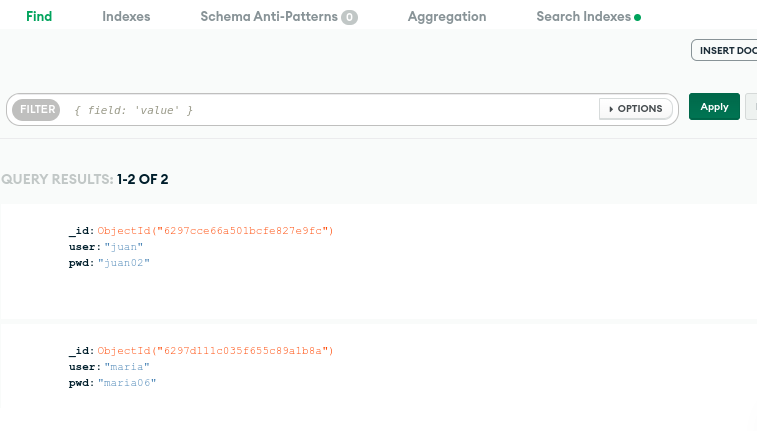
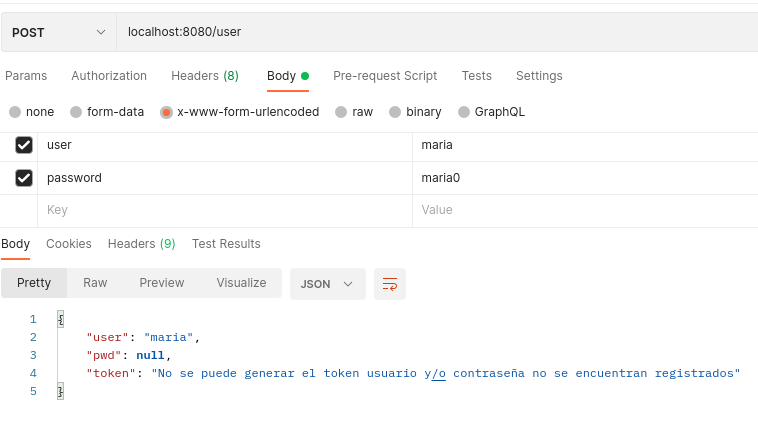
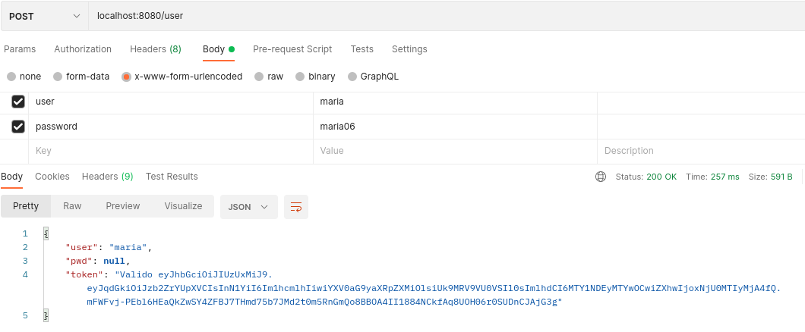

# JWT-demo-API-

## Solución a la actividad planteada:

### En la colección usuarios  creada en una base de datos MongoDB se tiene los siguientes registros:

#### Si el usuario y contraseña no se encuentran registrados en la base de datos, no se permite generar el token de ingreso. Como se muentra a continuación:

#### Si el usuario y contraseña se encuentran registrados en la base de datos, si es posible generar el token de ingreso:

